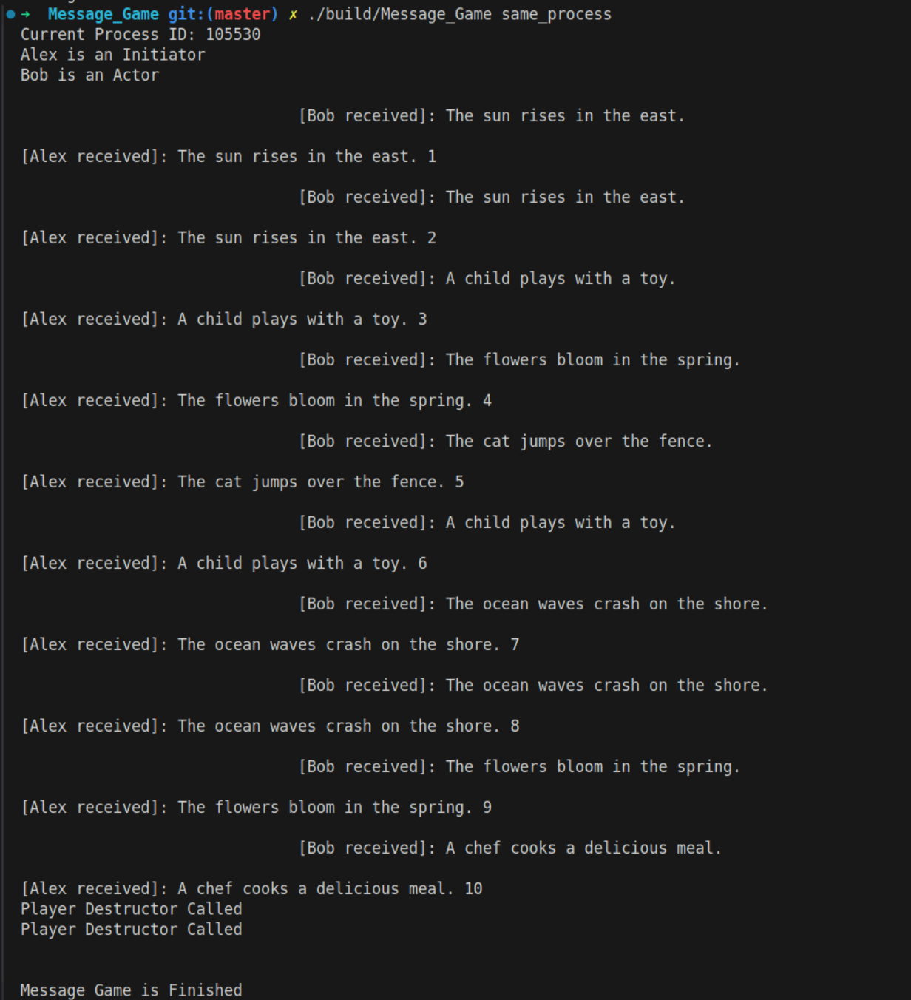
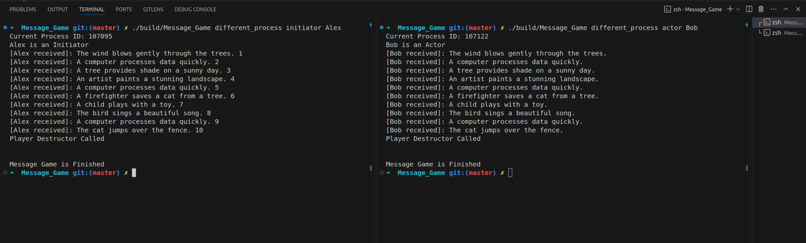

## Message Game
### This is a simple message game where two player communicates through messaging. There exists two types of players:
    - Initiator (starts the game by sending first message)
    - Actor (initially wait to receive a message from other player and join the game)

### Firstly, get into the project directory and run following commands to build the project.

```
 mkdir build
 cmake -B ./build
 cmake --build ./build
```

### This solution can be executed with two different approach. Let's run the project where two players communicate while they are in the same process:

```
./build/Message_Game same_process
```

#### We will get console output as follows:



### Now, let's run the project where two players communicate while they are in the different process. We need two different terminals and execute commands as following format.

#### Terminal 1:
```
./build/Message_Game different_process initiator Alex
```
#### Terminal 2:
```
./build/Message_Game different_process actor Bob
```

#### We will get console output as follows:
